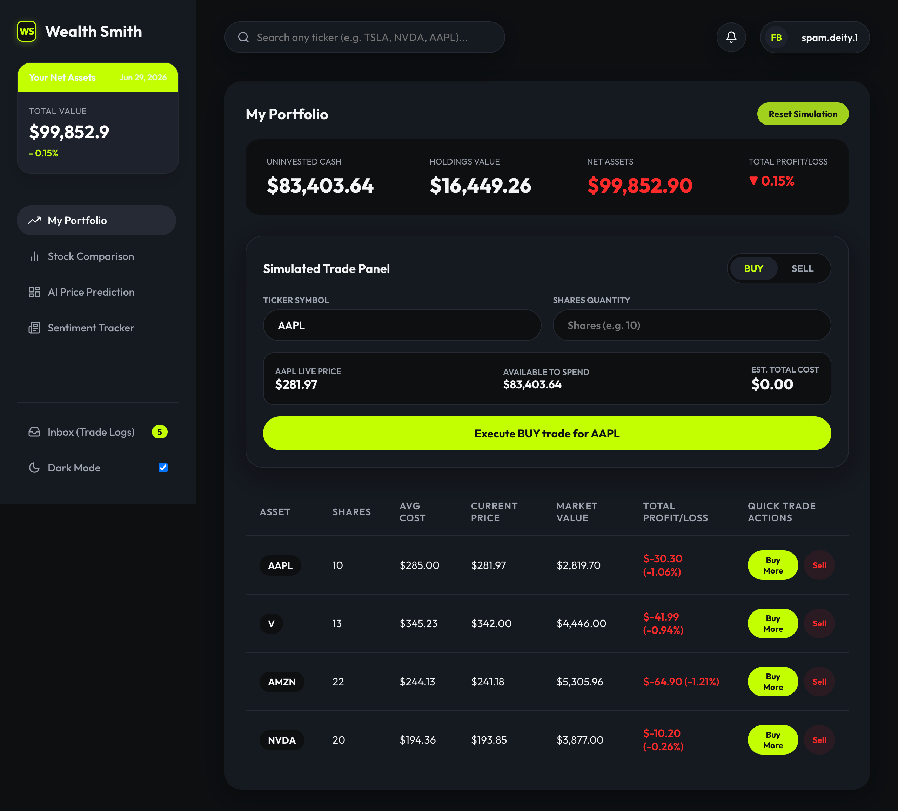

# Wealth Smith AI — Application Demonstrations & Output Showcase

Welcome to the visual demonstration guide for **Wealth Smith AI**. This document showcases the platform's core user interface, real-time analytics, multimodal AI inference engines, and cloud trading execution.

---

## Application Showcase & Descriptions

---

### 1. My Portfolio & Live Trading Simulator

- **Technical Description**: The primary asset management hub displaying real-time portfolio net valuation, profit/loss calculations, available cash reserves, and an interactive algorithmic trade simulator. Users can execute instant Buy/Sell orders that automatically calculate cost bases, update share positions, and persist changes to the backend database.

---

### 2. Interactive Canvas Technical Charting & Stock Comparison

- **Technical Description**: A multi-asset technical analytics panel featuring custom interactive HTML5 canvas line charts. It renders real-time price trend lines, moving average indicators, and side-by-side comparative stock cards to evaluate relative performance across multiple equities simultaneously.

---

### 3. Multimodal AI Trade Signal & Dual-Inference Engine

- **Technical Description**: The flagship quantitative intelligence interface showcasing live stock cards and dual-inference directional predictions. It synthesizes quantitative **LSTM Binary Classification** next-step price targets with qualitative **NLP News Sentiment** polarity metrics to output actionable `BUY`/`SELL`/`HOLD` execution recommendations with dynamic confidence scoring.

---

### 4. NLP Sentiment Tracker & Market News Feed

- **Technical Description**: A Natural Language Processing dashboard leveraging TF-IDF vectorization and multi-class neural network classification. It processes live financial news headlines to display a real-time sentiment gauge, net polarity score distributions (Bearish vs. Bullish), and curated news stream feeds.

---

### 5. Inbox — Executed Trade Audit Logs

- **Technical Description**: An interactive modal displaying persistent, immutable transaction logs retrieved from the database via `GET /api/transactions`. Each trade audit card details the execution type (`BUY`/`SELL`), ticker symbol, executed share quantity, execution price, and exact server timestamp.
