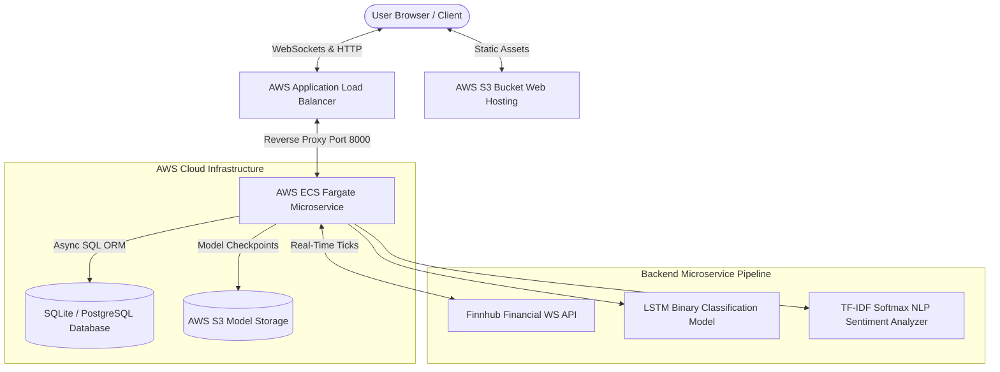

# Wealth Smith AI — Multimodal Financial Analytics & Algorithmic Trading Platform

[](https://www.python.org/)
[](https://fastapi.tiangolo.com/)
[](https://react.dev/)
[](https://aws.amazon.com/ecs/)
[](https://www.docker.com/)

**Wealth Smith AI** is an enterprise-grade, full-stack quantitative trading and financial analytics platform. It combines real-time WebSocket tick streaming, Deep Learning time-series binary classification (LSTM), Transformer/TF-IDF multi-class NLP market sentiment analysis, and resilient serverless cloud infrastructure on AWS.

Link : http://wealth-smith-frontend-web.s3-website-us-east-1.amazonaws.com/
---

## Key Features

- **Multimodal Decision Fusion Engine**: Synthesizes quantitative LSTM directional price predictions (`UP`/`DOWN`) with qualitative NLP news sentiment scores to output unified execution recommendations (`BUY`/`SELL`/`HOLD`).
- **Real-Time WebSocket Streaming**: Multiplexed high-concurrency event stream built with FastAPI & Finnhub WebSockets, broadcasting sub-second live trade ticks to client dashboards.
- **Interactive Trading Simulator & Portfolio Manager**: Real-time portfolio net asset calculator, unrealized P&L tracker, cash reserve management, and persistent database audit transaction logging.
- **Multi-Asset Live Tracking**: Concurrent WebSocket tracking across user portfolio holdings, custom stock comparisons, and core market watchlists.
- **Resilient AWS Cloud Infrastructure**: Containerized serverless execution via **AWS ECS Fargate**, zero-downtime traffic routing via an **AWS Application Load Balancer (ALB)**, and static web hosting on **AWS S3**.
- **Enterprise Authentication & Persistence**: Stateless JWT bearer tokens, bcrypt password hashing, dynamic OTP verification, and asynchronous ORM persistence via SQLAlchemy 2.0.

---

## System Architecture & Workflow Diagrams

### High-Level Cloud Infrastructure


### End-to-End Multimodal Processing & Trade Execution Workflow

```mermaid
sequenceDiagram
    autonumber
    actor User as Client / Browser
    participant Auth as Auth & Session Service
    participant WS as FastAPI WebSocket Multiplexer
    participant Finnhub as Finnhub WS API
    participant ML as LSTM Time-Series Classifier
    participant NLP as TF-IDF NLP Sentiment Engine
    participant Fusion as Decision Fusion Matrix
    participant DB as Async ORM Database

    %% Session Setup
    rect rgb(22, 25, 32)
        note right of User: 1. Authentication & Session Initialization
        User->>Auth: POST /api/auth/register or /login
        Auth->>DB: Verify Credentials / Log OTP
        DB-->>Auth: User Record Confirmed
        Auth-->>User: Return Signed JWT Session Token
    end

    %% Streaming & Data Pipeline
    rect rgb(27, 31, 40)
        note right of User: 2. Real-Time Streaming & Feature Preparation
        User->>WS: Connect /ws/predict (Subscribe Portfolio Tickers)
        WS->>Finnhub: Subscribe Symbol Channels (e.g. AAPL, NVDA, MSFT)
        Finnhub-->>WS: Sub-Second Trade Ticks (Price, Volume, Timestamp)
        WS->>WS: Append to 60-Sample Rolling Feature Buffer
    end

    %% Dual Inference Execution
    rect rgb(30, 35, 46)
        note right of User: 3. Multimodal Dual-Inference Execution
        par Quantitative Analysis
            WS->>ML: Pass Scaled 60-Price Window (MinMaxScaler)
            ML-->>WS: Predict Directional Probability (Sigmoid: UP / DOWN)
        and Qualitative Sentiment Analysis
            WS->>NLP: Fetch News & Clean Text (TF-IDF Vectorizer)
            NLP-->>WS: Compute Softmax Ratios (Bearish, Neutral, Bullish)
        end
        WS->>Fusion: Synthesize Technical Target & Net Sentiment Score
        Fusion-->>WS: Output Unified Execution Signal (BUY/SELL/HOLD + Confidence)
        WS-->>User: Broadcast Multimodal JSON Payload to Dashboard
    end

    %% Trade Execution & Audit Logging
    rect rgb(20, 28, 20)
        note right of User: 4. Persistent Trade Execution & Audit Logging
        User->>WS: POST /api/trades/execute (BUY/SELL Order)
        WS->>DB: Verify Cash Reserves & Calculate Holding Averages
        DB->>DB: Record Immutable Audit Log in Transaction Table
        DB-->>User: Return Updated Cash, Holdings & Refresh Inbox
    end
```


### Detailed Execution Workflow Breakdown

The end-to-end operational lifecycle of Wealth Smith AI follows a four-phase execution pipeline designed for high concurrency, low latency, and deterministic decision-making:

#### Phase 1: Authentication & Session Initialization
- When a user accesses the application, credentials or registration requests are routed through FastAPI authentication handlers (`auth.py`).
- Passwords are verified using `bcrypt` hashing, and an OTP verification flow validates user account authenticity.
- Upon validation, the backend issues an encrypted stateless JWT bearer token. The React frontend stores this token and passes it in the `Authorization` header for all subsequent REST and WebSocket requests.

#### Phase 2: Real-Time Ingestion & Feature Preparation
- The frontend establishes a persistent WebSocket connection to `/ws/predict`.
- The FastAPI WebSocket Connection Manager aggregates all active symbols requested across user portfolios, watchlists, and comparison views, multiplexing them into a single outgoing subscription request to Finnhub's WebSocket stream.
- Sub-second trade ticks (price, volume, timestamp) are received and cached in memory. The backend maintains a rolling 60-sample price window buffer per active asset, transforming raw ticks into scaled input tensors via `MinMaxScaler`.

#### Phase 3: Multimodal Dual-Inference & Decision Fusion
- **Quantitative Time-Series Inference**: The scaled 60-sample sequence is passed into the trained LSTM model (`Sequential([LSTM(50), Dropout(0.2), Dense(1, activation='sigmoid')])`). The network outputs a directional probability value indicating whether the next price step will move `UP` (label 1) or `DOWN` (label 0).
- **Qualitative NLP Sentiment Inference**: Simultaneously, live news headlines and article summaries are scraped and processed through `text_processor.py`. The text is vectorized via TF-IDF (`tfidf_vectorizer.pkl`) and evaluated by a Keras Softmax neural network (`sentiment_model.h5`), returning multi-class ratios for `Bearish`, `Neutral`, and `Bullish` market narratives.
- **Multimodal Decision Fusion**: The Decision Fusion Matrix combines the quantitative directional probability with the net NLP sentiment score (`bullish_ratio - bearish_ratio`). If technical momentum and news sentiment align positively, the system outputs a unified `BUY` recommendation with a dynamic confidence percentage. If indicators diverge or signal downward momentum, it outputs `SELL` or `HOLD`. The combined JSON payload is pushed over WebSockets to update the UI live.

#### Phase 4: Persistent Trade Execution & Audit Logging
- When a user submits an order via the Trading Simulator, the request hits `POST /api/trades/execute`.
- Using an asynchronous SQLAlchemy session, the backend validates user cash reserves, calculates the new average cost basis for owned holdings, and updates balance records.
- An immutable transaction record detailing the action (`BUY`/`SELL`), ticker symbol, quantity, price, and exact UTC server timestamp is committed to the database. The frontend immediately receives updated portfolio metrics and refreshes the Inbox trade audit log.

---

## Machine Learning Specifications

### 1. Binary Classification Time-Series LSTM Engine (`ml_core/train.py`)
- **Architecture**: Sequential Deep LSTM Network (`Sequential([LSTM(50) -> Dropout(0.2) -> Dense(1, activation='sigmoid')])`).
- **Loss & Optimizer**: `binary_crossentropy` loss trained with the `Adam` optimizer.
- **Preprocessing**: 60-sample rolling window sequences preprocessed with `MinMaxScaler`.

### 2. TF-IDF Multi-Class Softmax NLP Engine (`ml_core/nlp_engine/`)
- **Vectorizer**: Pre-trained TF-IDF vectorizer converting raw financial news headlines into feature matrices.
- **Classifier**: Multi-Class Deep Neural Network predicting Softmax probability distributions across 3 sentiment classes: `Bearish (0)`, `Neutral (1)`, and `Bullish (2)`.
- **Scoring**: Computes net sentiment scores (`bullish_ratio - bearish_ratio`) bounded within `[-1.0, +1.0]`.

---

## Local Development Setup

### Prerequisites
- Node.js (v18+) & npm
- Python (v3.12+)
- Docker Desktop

### 1. Clone & Setup Environment
```bash
git clone https://github.com/Mr-Smarty-331/Wealth-Smith.git
cd Dashboard
```

### 2. Backend Setup (FastAPI)
```bash
cd backend/ws-backend
python -m venv venv
source venv/bin/activate  # On Windows: venv\Scripts\activate
pip install -r requirements.txt
uvicorn main:app --reload --port 8000
```

### 3. Frontend Setup (React + Vite)
```bash
cd frontend
npm install
npm run dev
```

---

## Docker & Cloud Deployment

### Build & Run via Docker Compose locally
```bash
docker-compose up --build
```

### Deploy Backend Container to AWS ECR & ECS
```bash
aws ecr get-login-password --region us-east-1 | docker login --username AWS --password-stdin <AWS_ACCOUNT_ID>.dkr.ecr.us-east-1.amazonaws.com
docker build --platform linux/arm64 -t wealth-smith-backend ./backend/ws-backend
docker tag wealth-smith-backend:latest <AWS_ACCOUNT_ID>.dkr.ecr.us-east-1.amazonaws.com/wealth-smith-backend:latest
docker push <AWS_ACCOUNT_ID>.dkr.ecr.us-east-1.amazonaws.com/wealth-smith-backend:latest
aws ecs update-service --cluster wealth-smith-cluster --service wealth-smith-backend-service --force-new-deployment
```

---

## License

Distributed under the MIT License. See `LICENSE` for more information.
